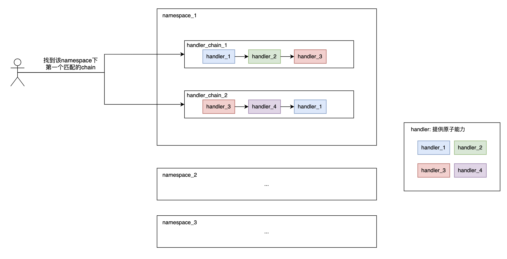

# Quick Start

```java
String namespace = "default";
        
DefaultHandlerChain<Object, Object> firstChain = HandlerChain.builder().namespace("推单任务")
        .namespace(namespace)
        .addHandler(new OneHandler())
        .addHandler(new TwoHandler())
        .matcher(new AnyMatcher<>())
        .order(1)
        .build();
DefaultHandlerChain<Object, Object> secondChain = HandlerChain.builder().namespace("推单任务")
        .namespace(namespace)
        .addHandler(new OneHandler())
        .addHandler(new ThreeHandler())
        .matcher(new AnyMatcher<>())
        .order(2)
        .build();
Object inputContext = new Object();
Object outputContext = new Object();

ChainManager.handle("haha", inputContext, outputContext);
        
```

# Design


